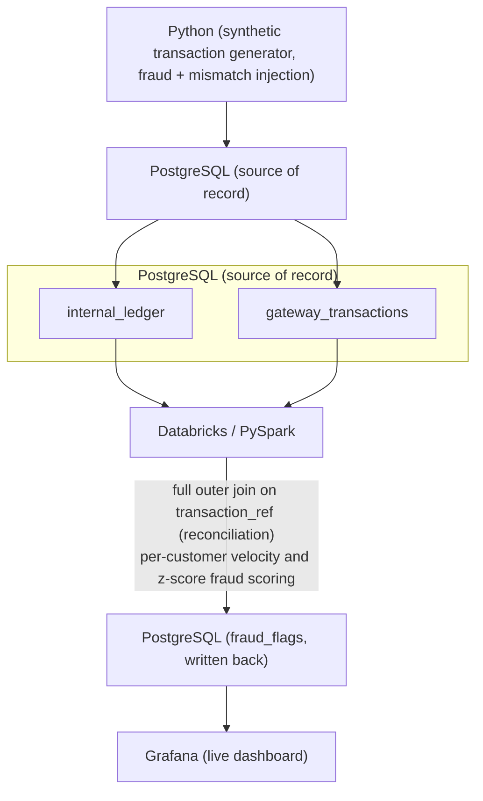

# Real-Time Fraud & Ledger Reconciliation Pipeline
## Project Overview
This project implements an end-to-end fraud detection and ledger reconciliation pipeline for a simulated fintech environment. Synthetic transaction data is generated in Python and loaded into PostgreSQL as two independent sources of truth, an internal ledger and a payment gateway feed, deliberately seeded with reconciliation drift. Databricks (PySpark) then joins the two sources to surface mismatches and applies fraud-scoring logic to flag suspicious activity. Results are written back to PostgreSQL, where Grafana renders a live monitoring dashboard.

The objective is to demonstrate the full lifecycle a fintech data team deals with in production: ingesting transactional data, detecting where two systems of record disagree, scoring transactions for suspicious patterns, and surfacing all of it on a dashboard an analyst would actually use.

## Problem Statement

Fintech platforms process transactions through multiple systems that don't always agree. A bank's internal ledger and a payment gateway's records can drift apart due to dropped webhooks, duplicate retries, or timing mismatches, while fraudulent transactions slip through unnoticed without active scoring. Without a reconciliation and monitoring layer, businesses cannot:

Detect when internal balances no longer match what the payment provider actually processed
Catch suspicious transaction patterns (rapid small debits, abnormal amounts) close to real time
Give analysts a single place to review flagged activity and its resolution status
Quantify how much drift or fraud risk exists in the system at any given point

## Architecture

## Architecture Components

| Component | Tool |
| :--- | :--- |
| Data generation | Python (psycopg2, Faker) |
| Transactional storage | PostgreSQL |
| Analytics / scoring engine | Databricks (PySpark, Spark SQL) |
| Monitoring dashboard | Grafana |
| Version control | Git + GitHub |

## Key Concepts Demonstrated

Simulating two independent systems of record and reconciling them

Full outer join reconciliation logic (matched, amount mismatch, missing in gateway, missing in ledger)

Per-customer statistical fraud scoring (velocity breach, amount outlier via z-score)

Writing analytics engine output back to an operational database

Building a monitoring dashboard from live query results, not static exports

Git branch-per-feature workflow (schema, generator, analytics) merged back to master

## Dataset

The dataset is synthetic, generated by src/generator.py rather than sourced externally, so drift and fraud rates are controlled and known in advance.

| Table	| Description |
| :--- | :--- |
| customers | 200 simulated customers with starting balances
| internal_ledger | 5,000 transactions representing the bank's own record	
| gateway_transactions | The payment gateway's version of the same transactions, with ~5% deliberately dropped, duplicated, or amount-shifted	
| fraud_flags | Output of the scoring logic, with reason, severity, and resolution outcome
	

Fraud patterns injected: velocity bursts (multiple small debits in a short window) and statistical amount outliers relative to each customer's own spending baseline.

Tech Stack
Layer	Technology
Data generation	Python 3, psycopg2, Faker
Data warehouse / OLTP	PostgreSQL
Analytics engine	Databricks (PySpark, Spark SQL)
Dashboard	Grafana
Version control	Git, GitHub
Database Schema
customers
├── customer_id (PK)
├── full_name
├── account_number
├── balance
└── created_at

internal_ledger
├── ledger_id (PK)
├── transaction_ref (unique, links to gateway_transactions)
├── customer_id (FK → customers)
├── amount
├── transaction_type
├── channel
├── merchant
├── status
└── created_at

gateway_transactions
├── gateway_id (PK)
├── transaction_ref (links to internal_ledger, not enforced FK by design)
├── amount
├── gateway_status
└── received_at

fraud_flags
├── flag_id (PK)
├── transaction_ref
├── reason              -- velocity_breach, amount_outlier
├── severity
├── flagged_at
├── resolved             -- has an analyst reviewed this case
└── outcome              -- pending, confirmed_fraud, false_positive

transaction_ref is intentionally not a hard foreign key between internal_ledger and gateway_transactions, since the entire point of the reconciliation step is that the two tables are allowed to disagree.

Pipeline Walkthrough

1. Generation. src/generator.py seeds 200 customers, then produces 5,000 transactions. Each transaction is written to internal_ledger, then mirrored into gateway_transactions with roughly 5% intentionally corrupted (dropped, duplicated, or amount-shifted) to simulate real-world gateway drift.

2. Reconciliation. In Databricks, internal_ledger and gateway_transactions are joined with a full outer join on transaction_ref. Each row is classified as matched, amount_mismatch, missing_in_gateway, or missing_in_ledger.

3. Fraud scoring. Two detection rules run over internal_ledger:

Velocity breach: multiple small transactions from the same customer within a tight time window
Amount outlier: transactions more than 3 standard deviations from that specific customer's average transaction amount, computed per customer rather than globally

4. Write-back. Flagged transactions are written to fraud_flags in PostgreSQL, including a reason, severity, and starting outcome of pending, to be updated as an analyst reviews each case.

5. Dashboard. Grafana connects directly to PostgreSQL and renders three panels: flag volume by reason, outcome breakdown (pending / confirmed fraud / false positive), and flag volume over time.

Dashboard

The Grafana dashboard includes:

Flag volume by reason — proportion of flags from velocity breaches vs. amount outliers
Outcome breakdown — how many flagged transactions are still pending review vs. confirmed fraud vs. resolved as false positives
Flags over time — flag volume trend across the simulated time window

(Add dashboard screenshot here.)

File Structure
fintech-fraud-reconciliation/
├── src/
│   └── generator.py          # synthetic transaction generator
├── sql/
│   └── schema.sql            # table definitions
├── configs/                  # reserved for connection/config files
├── .gitignore
└── README.md

Databricks notebooks currently live in the Databricks workspace and are not yet version-controlled in this repo. Exporting them into a databricks/ folder is listed under Future Developments.

How to Run
bash
# 1. Create the database and schema
createdb fraud_recon
psql -U postgres -d fraud_recon -f sql/schema.sql

# 2. Install dependencies
pip install psycopg2-binary faker

# 3. Generate synthetic data
python src/generator.py

# 4. Run reconciliation and fraud scoring in Databricks
#    (upload the exported CSVs or connect Spark directly, run the notebook)

# 5. Connect Grafana to PostgreSQL and import the dashboard panels
Future Developments
Replace manual CSV export/import between Postgres and Databricks with a live JDBC connection
Move from batch generation to streaming ingestion for a true real-time pipeline
Add CI/CD to run schema migrations and tests automatically on push
Add Grafana alerting on flag rate thresholds
Build out the analyst review workflow (outcome field) into an actual interface instead of manual SQL updates
Version-control the Databricks notebooks alongside the rest of the codebase
